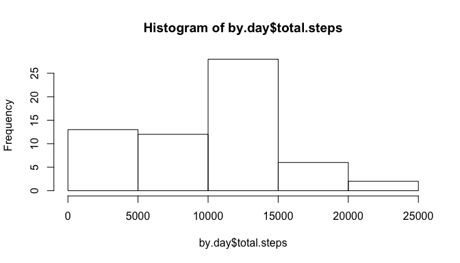
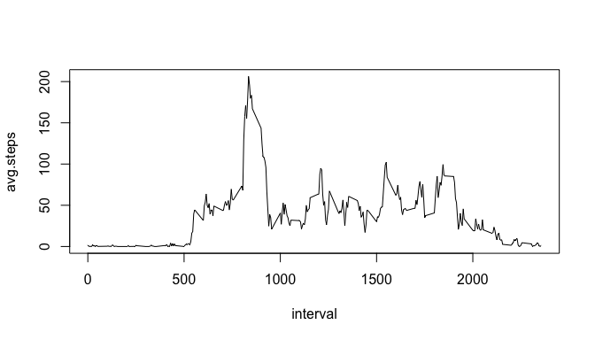
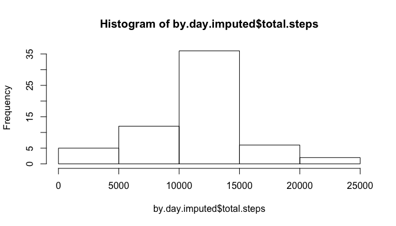
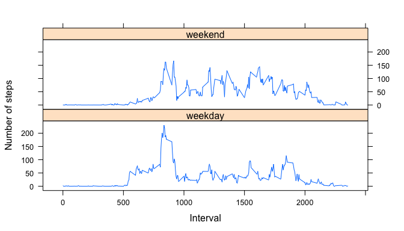

# Reproducible Research: Peer Assessment 1


## Loading and preprocessing the data

We first parse the file `activity.csv`, which is extracted to our current directory from the downloaded file [Activity monitoring data](https://d396qusza40orc.cloudfront.net/repdata%2Fdata%2Factivity.zip).

```r
setwd('~/Downloads/')
df <- read.csv('activity.csv')
str(df)
```

```
## 'data.frame':	17568 obs. of  3 variables:
##  $ steps   : int  NA NA NA NA NA NA NA NA NA NA ...
##  $ date    : Factor w/ 61 levels "2012-10-01","2012-10-02",..: 1 1 1 1 1 1 1 1 1 1 ...
##  $ interval: int  0 5 10 15 20 25 30 35 40 45 ...
```

## What is mean total number of steps taken per day?

We sum the steps per day, and then build a histogram:


```r
library(dplyr)
```

```
## 
## Attaching package: 'dplyr'
## 
## The following object is masked from 'package:stats':
## 
##     filter
## 
## The following objects are masked from 'package:base':
## 
##     intersect, setdiff, setequal, union
```

```r
by.day <- df %>% group_by(date) %>% summarize(total.steps = sum(steps, na.rm=T))
hist(by.day$total.steps)
```

 

The mean total number of steps per day is 9354, while the median is 10395.

## What is the average daily activity pattern?

Now we get the average steps per time interval, and build a time series plot:


```r
by.interval <- df %>% group_by(interval) %>% summarize(avg.steps = mean(steps, na.rm=T))
plot(avg.steps ~ interval, data=by.interval, type='l')
```

 

```r
max.interval <- by.interval$interval[[which(by.interval$avg.steps == max(by.interval$avg.steps))]]
max.interval
```

```
## [1] 835
```

The 5-minnute interval that, on average across all the days in the dataset contains the maxinum number of steps is 835.

## Imputing missing values

Lets count the number of missings in our dataset:


```r
colSums(is.na(df))
```

```
##    steps     date interval 
##     2304        0        0
```

Only `steps` has missing values, and there are 2304, 0, 0 rows with missing values.

We are going to replace those rows with the average step value for the given interval value.


```r
avg.step <- function(interval){ by.interval$avg.steps[[which(by.interval$interval == interval)]] }
has_nas <- which(is.na(df$steps))
imputed <- df #Make a new df
imputed$steps[has_nas] <- sapply(df$interval[has_nas], avg.step)
sum(is.na(imputed$steps))
```

```
## [1] 0
```

Now lets recompute steps per day and the mean and median of these sums.


```r
by.day.imputed <- imputed %>% group_by(date) %>% summarize(total.steps = sum(steps))

hist(by.day.imputed$total.steps)
```

 

```r
t <- data.frame(Original = c(mean(by.day$total.steps), median(by.day$total.steps)),
                Imputed = c(mean(by.day.imputed$total.steps), median(by.day.imputed$total.steps)))
row.names(t) <- c("mean", "median")
t
```

```
##        Original  Imputed
## mean    9354.23 10766.19
## median 10395.00 10766.19
```

From the above table, you can see the dataset with imputed steps where it was NA does differ from the original.

## Are there differences in activity patterns between weekdays and weekends?

We create a `date.type` field of our `imputed` dataset that has the value *weekend* when *date* falls on a Saturday or a Sunday, otherwise is *weekday*.

We then plot the 

```r
imputed$day.type = factor(weekdays(strptime(imputed$date, "%Y-%m-%d")) %in% c("Saturday", "Sunday"), 
                          labels=list("FALSE"="weekday", "TRUE"="weekend"))
by.day.type <- split(imputed, imputed$day.type)
weekday.by.interval <- by.day.type$weekday %>% group_by(interval) %>% 
                        summarize(avg.steps = mean(steps), day.type = "weekday")
weekend.by.interval <- by.day.type$weekend %>% group_by(interval) %>% 
                        summarize(avg.steps = mean(steps), day.type = "weekend")
by.day.and.interval <- rbind(weekday.by.interval, weekend.by.interval)

library(lattice)
xyplot(avg.steps ~ interval | day.type, data=by.day.and.interval, layout=c(1, 2), 
       type='l', xlab = 'Interval', ylab='Number of steps') 
```

 
